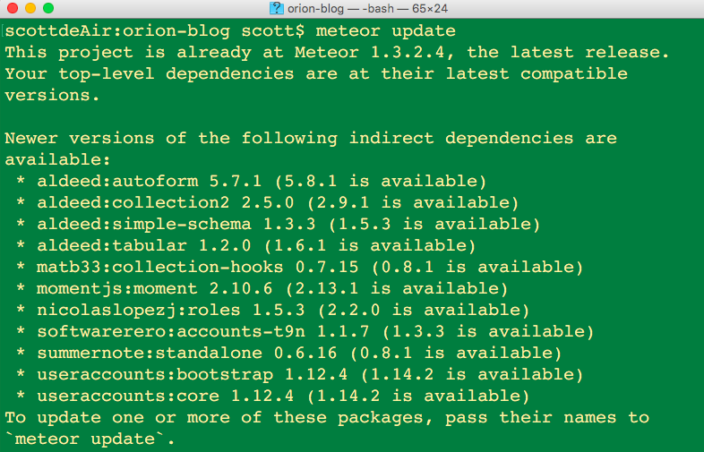

1. 本机安装meteor
```
curl https://install.meteor.com | sh
```

2. 创建项目
```
meteor create projectName
```

3. 手动升级不成功的插件
```
 * aldeed:autoform 5.7.1 (5.8.1 is available)
 * aldeed:tabular 1.2.0 (1.6.1 is available)
 * matb33:collection-hooks 0.7.15 (0.8.1 is available)
 * mdg:validation-error 0.2.0 (0.5.1 is available)
 * momentjs:moment 2.10.6 (2.13.1 is available)
 * nicolaslopezj:roles 1.5.3 (2.2.0 is available)
 * softwarerero:accounts-t9n 1.1.7 (1.3.3 is available)
 * summernote:standalone 0.6.16 (0.8.1 is available)
 * useraccounts:bootstrap 1.12.4 (1.14.2 is available)
 * useraccounts:core 1.12.4 (1.14.2 is available)
```


4. 权限升级过,停止运行项目,reset项目
```
scottdeAir:orion-blog scott$ meteor reset
Project reset.
```

```
=> App running at: http://localhost:3000/
I20160519-01:07:38.802(8)? Orion config initialized
I20160519-01:07:38.804(8)? Orion dictionary initialized
```


