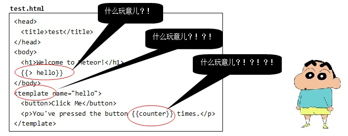
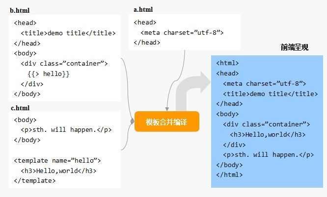
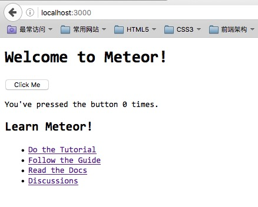

模板文件 - main.html

打开main.html，你可能会略有不适：

它不是一个标准的HTML文件：没有html顶层标签，奇怪的符号{{> hello}}... 不过，在Metoer中这样的文件却是合法的文件 —— 模板文件。

≡ 模板顶层标签 —— head/body/template

Meteor规定，在一个模板文件里，只能出现三种顶层标签：head、body和template。 也就是说，模板文件只能包含以这三种标签为顶层标签的HTML片段。

这是因为，Meteor在运行应用之前有一个打包/bundle的过程，此时Meteor会提取所有 模板文件（一个应用中可以有多个模板文件）中的head、body和template片段，分别进行 合并、编译后才呈现给用户：

上图中，a.html和b.html中的head片段合并后作为最终的head内容，b.html和c.html中 的body片段合并后作为最终的body内容，至于c.html中的template的内容，则最终替换了 b.html中的{{> hello}}。

≡ 模板语言 —— Spacebars

Meteor的模板使用的语言是私有的spacebars语言，它基于流行的handlebars，通过 在HTML片段中嵌入模板标签（以两对大括号为边界）实现模板化。因此，Meteor的模板 其实就是HTML标签和模板标签的混合体。

{{> hello}}模板标签用来调用一个子模板，Meteor将在最终呈现给用户的HTML文档中， 使用子模板hello的内容进行原地替换。

特殊的template标签用来定义一个子模板。

{{counter}}模板标签执行插值工作，Meteror将在最终呈现给用户的HTML文档中，使用 标识符counter对应的值进行原地替换。

> 运行结果

