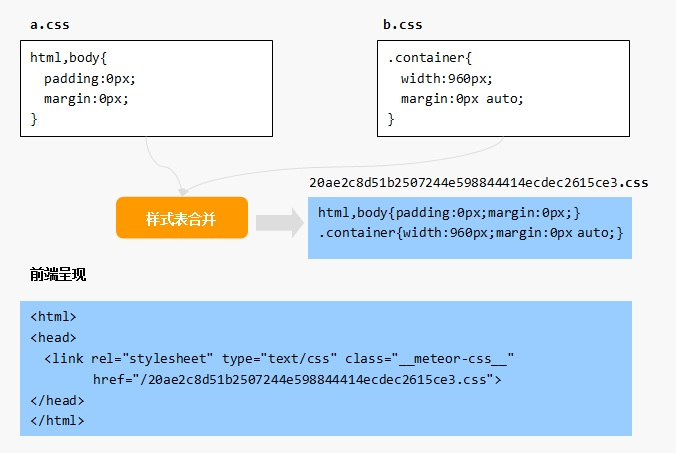
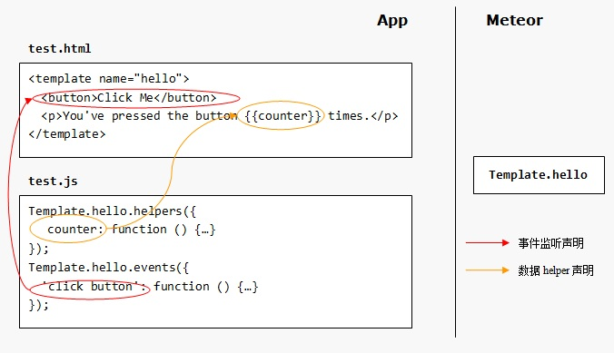

1. 模板文件 - main.html

打开main.html，你可能会略有不适：


它不是一个标准的HTML文件：没有html顶层标签，奇怪的符号{{> hello}}... 不过，在Metoer中这样的文件却是合法的文件 —— 模板文件。

≡ 模板顶层标签 —— head/body/template

Meteor规定，在一个模板文件里，只能出现三种顶层标签：head、body和template。 也就是说，模板文件只能包含以这三种标签为顶层标签的HTML片段。

这是因为，Meteor在运行应用之前有一个打包/bundle的过程，此时Meteor会提取所有 模板文件（一个应用中可以有多个模板文件）中的head、body和template片段，分别进行 合并、编译后才呈现给用户：


上图中，a.html和b.html中的head片段合并后作为最终的head内容，b.html和c.html中 的body片段合并后作为最终的body内容，至于c.html中的template的内容，则最终替换了 b.html中的{{> hello}}。

≡ 模板语言 —— Spacebars

Meteor的模板使用的语言是私有的spacebars语言，它基于流行的handlebars，通过 在HTML片段中嵌入模板标签（以两对大括号为边界）实现模板化。因此，Meteor的模板 其实就是HTML标签和模板标签的混合体。

{{> hello}}模板标签用来调用一个子模板，Meteor将在最终呈现给用户的HTML文档中， 使用子模板hello的内容进行原地替换。

特殊的template标签用来定义一个子模板。

{{counter}}模板标签执行插值工作，Meteror将在最终呈现给用户的HTML文档中，使用 标识符counter对应的值进行原地替换。

> 运行结果


2. 样式文件 - main.css

   和模板文件类似，Meteor在打包过程中，会将所有的样式文件合并成一个大的样式文件， 然后在呈现给用户的HTML文档中引用这个样式文件：



上图中，a.css和b.css的内容将被合并为一个文件，并在最终呈现给用户的HTML文档中， 使用link标签引用这个文件。


3. 代码文件 - main.js

   main.js是最有趣的文件，Meteor将在前端和后端同时运行这个文件。可以这样理解：

       . 前端 - Meteor将在最终呈现给用户的HTML文档中使用script标签引用test.js
       . 后端 - Meteor将通过NodeJS读入并运行test.js

   毫无疑问，如果不做任何处理，谁也没法保证一段JS代码既可以在前端浏览器环境中运行， 也可以在后端NodeJS中运行。在main.js中，我们需要判断当前的具体运行环境，以便 执行相应的代码。

   ≡ 判断代码执行环境 —— Meteor.isClient/Meteor.isServer

   让同一个js文件即可以跑在前端，也可以跑在后端（比如NodeJS），已经有很多 应用了，只需要判断下在某个特定环境才存在的变量就可以了（比如，NodeJS有global，而 浏览器有window）。Meteor提供了一组更加清晰的API来实现这个判断：

       Meteor.isClient - 为真时，表示当前运行环境为前端
       Meteor.isServer - 为真时，表示当前运行环境为后端

   你可以看到，在main.js中也是这么做的：
    ```
    //test.js
    if(Meteor.isClient){
      //仅在前端执行的代码块
    }
    if(Meteor.isServer){
      //仅在后端执行的代码块
    }
    ```

    运行应用后，你将在后台的终端中看到Hello,Meteor!，也将在前台的调试台 中看到相同的输出。

4. 前端代码 - 模板实例对象

   回忆下，在模板文件main.html中，我们定义了一个模板：
   ```
   <!--main.html-->
   <template name="hello">
     <button>Click Me</button>
     <p>You've pressed the button {{counter}} times.</p>
   </template>
    ```
   当Meteor运行这个应用时，将自动创建一个对应的模板实例对象:Template.hello。 对模板的数据绑定和事件绑定，这些通常需要使用JavaScript实现的功能，就通过这个对象来实现:



在hello模板中，{{counter}}模板标签中的标识符couter的值，将由对应模板实例 对象的counter函数返回值决定，这个函数被称为模板的helper函数，使用模板实例的 helpers()方法声明模板标签中标识符对应的helper函数。

而通过模板实例对象的events方法，则为模板中的button元素挂接了click事件监听处理 函数。

5. 前端代码 - 模板标签标识符解析/helper

   使用Template.hello.helpers(helpers)方法声明hello模板中模板标签标识符 的解析函数。参数helpers是一个JS对象，属性表示应用在模板标签中的标识符，值 通常是一个函数，被称为helper，大致是帮助Meteor解析模板中的标识符的值 这样的意思。

   比如，在main.js中我们为hello模板中出现在{{counter}}模板标签中的counter表达式声明其对应的helper函数：
   ```
   //test.js
   Template.hello.helpers({
     'counter':function(){
       return Session.get('counter');
     }
   });
   ```
   每次当Meteor需要对模板标签{{counter}}进行计算时，都将调用其counter标识符 对应的helper函数进行计算：它简单地返回Session变量counter的当前值。

   ≡ 为helper函数设定参数

   helper函数可以接受参数，比如对于模板main中的displayName标识符：
   ```
   <template name="test">
     <h1>Hello,{{displayName "Jason" "Mr."}}!</h1>
   </template>
   ```
   声明如下的helper函数：
   ```
   Template.test.helpers({
     'displayName' : function(name,title){
       return title + ' ' + name;
     }
   });
   ```
   那么Meteor渲染后将获得如下的HTML结果：
   ```
   <h1>Hello,Mr. Jason!</h1>
   ```
   ≡ 使用常量helper

   当然，也可以将helper定义为一个常量：
   ```
   Template.test.helpers({
     displayName : "Mr. WHOAMI"
   })
   ```
   这时，模板标签{{displayName}}将永远地被设定为固定的值了。

6. 前端代码 - 模板事件绑定

   使用Template.hello.events(eventMap)方法声明hello模板中DOM对象的事件绑定。 参数eventMap是一个JS对象，属性表示要处理的事件，值表示事件处理函数。

   比如，在test.js中我们为hello模板中的所有DOM对象挂接点击事件监听函数：
   ```
   Template.hello.events({
     'click':function(event,tpl){...}
   })
   ```
   也可以使用CSS选择符为指定的DOM对象挂接监听事件：
   ```
   Template.hello.events({
     'click button' : function(event,tpl){...}
   });
   ```
   还可以同时为多个事件指定同一个监听函数：
   ```
   Template.hello.events({
     'click button,keypress input':function(event,tpl){...}
   });
   ```
   监听函数触发时，Meteor将传入两个参数：event表示DOM事件对象， 而tpl则代表触发事件的DOM对象所属的模板实例。通过tpl对象的jQuery 操作符可以轻松地进行DOM操作：
   ```
   Template.hello.events({
     'click button#changetext':function(event,tpl){
         tpl.$("input").text("what are you doing!");
     }
   });
   ```